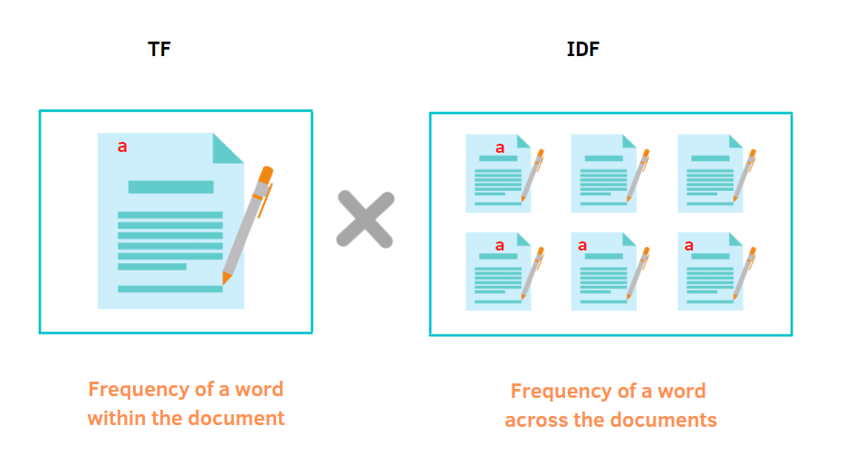
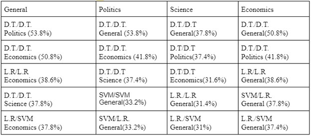

<html lang="en">
 <body>
  <h1>Finding Commonalities in Misinformative Articles Across Various Topics</h1>
  <h5> By: Maximilian Halvax, Lucas Nguyen, Hwang Min Yu</h5>
   <h2>What Data Are We Using?</h2>
    
         

  
Our data is collected from <a href="http://fakenews.research.sfu.ca/#parseWebs">Simon Fraser University's fake news research</a> where we used the datasets containing Snopes, Politifact, and Emergent.info articles of varying real and fake news from 2010 to 2018. We took articles from each dataset to create a new dataset that contains real and fake news for specific genres of news. We gathered news about 100 data for each political and scientific topic from the Snopes, Politifact, and Emergent.info datasets to use as our training dataset. We also created a dataset filled with varying topics to use as our testing dataset The data included in this set is a mix of recent informative and misinformative articles. Our plan with these datasets is to find commonalities of misinformation across different topics. To do this, we are training our models based on set genres and then testing the results to a set of data with varying genres of news. 

  
   <h2>What are we trying to predict</h2>
  
  

   
For our research, we are using our training dataset to predict whether a random article, regardless of the genre, is misinformative or not. After Preprocessing with TFIDF We will train our models so that it learns the commonalities of misinformation for a set topic. Then we will test our findings onto a random article to see if our model can accurately predict whether that article is misinformative or not. We use the scores of the Decision Tree, Logistic Regression, Random Forest Classifier, and SVM to test our models’ accuracies. After our models make a prediction on a random genre article, we want to examine differences of misinformation across different genres of news. 

  
   <h2>What models and techniques are we using for prediction</h2>
    <h3>TF-IDF</h3>
  
  
  

  
   
We used the natural lanaguage processing (NLP) technique called term frequency and inverse document frequency, TF-IDF, to score the words from articles for the most important words of each topic we were testing. We input the scores from TF-IDF through our models for prediction. As our final result, we get an accuracy, precision, and recall score to determine how well our models predicted articles as misinformative or not.

  
   <h3>Decision Tree </h3>
   
  

  
Decision Tree is a machine learning method that involves many leafs and branches to reach a classification.

   <h3>Logistic Regression</h3>
    
  

   
Logisitic Regression is a machine learning method that results in a discrete (1,0) classification based on variables inputted.

   <h3>Random Forest Classifier</h3>
    
  

   
Random Forest Classifier is a machine learning method that runs multiple decisions trees and uses the classification the majority choses.

   <h3>Support Vector Machine (SVM)</h3>
    
  

   
Support Vector Machine is a machine learning method used to find the best hyperplane that separates the data into two distinct classes.

   <h2>Data Analysis</h2>
    
Since our goal was to see if there were themes to the misinformation of each topic, we looked at what words would be the most important in deciding between informative and misinformative. We used a Word Cloud figure to visualize the important words of informative and misinformative articles across each topic of study. For consistency, we used logistic regression as our base model for determining these clouds.

   <h3>Science</h3>

   
  

   
The image above is the word cloud of most important words for informative science articles. The most interesting words of informative science's word cloud are Lexus, chip, honey, and Ukraine. This result is interesting because it shows that informative science articles mainly focus on the subject of the article.

   
  

   
The image above is the word cloud of most important words for misinformative science articles. The most interesting words that are visible by this word cloud are part, time, well, and more. These words are interesting because they focus on the descriptions to the subject compared to the focus on the subject of the informative science articles.

   <h3>Economics</h3>

   
  

   
The image above is the word cloud of most important words for informative economic articles. The most interesting words of informative economy's word cloud are been, when, had, and without. This result is different compared to informative science articles where its main focus was the subject of the article. Economic informative article focuses more on occasions.

   
  

   
The image above is the word cloud of most important words for misinformative economic articles. The most interesting words of misinformative economy's word cloud are care, from, elected, and on. This result focuses a lot more on actions rather than the subject of the article.

   <h3>Politics</h3>

   
  

   
The image above is the word cloud of most important words for informative political articles. The most interesting words of informative politics's word cloud are Florida, Maher, Romney, and King. This result is a similar case to informative science article's results. There is more focus on the subject of the article.

   
  

   
The image above is the word cloud of most important words for misinformative political articles. The most interesting words of misinformative politics's word cloud are has, was, more, told, and did. This result is similar to misinformative economic article's results. There is more focus on the action rather than the subject of the article.

   <h3>General</h3>

   
  

   
The image above is the word cloud of most important words for informative articles with the topics science, economy, and politics all combined. The most interesting words for this word cloud are Covid, Romney, billion, city, and wealth. The result is interesting since there is a mixture of focus on the subject and description of the subject.

   
  

   
The image above is the word cloud of most important words for misinformative articles with the topics science, economy, and politics all combined. The most interesting words for this word cloud are high, most, nearly, several, and more. This result is interesting because these descriptive words are mostly used to describe more of something. Based on the nature of misinformation, it could be hypothesized that misinformative articles use these kinds of descriptive words to exaggerate the subject of its article.

   <h2>Results and Conclusions</h2>
    <h3>Accuracy Percision and Recall</h3>
     
As is consistent with the other projects that look at this issue, we ended up with somewhat lower accuracies. When examining the accuracies of the models, we decided to show both ends of performance for each topic, the best and the worst. The results below are our top and worst performers for each topic. We are showing only one of each best and worst models.

   <h4>General</h4>
    <h5>Best Model</h5>
    
  

    
   <h5>Worst Model</h5>
   
  

   <h4>Science</h4>
    <h5>Best Model</h5>
    
  

  
   <h5>Worst Model</h5>
   
  

   <h4>Economics</h4>
    <h5>Best Model</h5>
    
  

  
   <h5>Worst Model</h5>
   
  

   <h4>Politics</h4>
    <h5>Best Model</h5>
    
  

  
   <h5>Worst Model</h5>
   
  

   
We certainly had variances in success. Our best performing model was the science decision tree, with an accuracy of about 73.9%. Our worst performing model was the economy random forest, with an accuracy of 48%

   <h3>Commonalities</h3>
  
  
  

  
   
To evaluate commonalities between our topics and models, we wanted to examine where each model had overlap in their sets of important words. For models, Decision trees were the most likely to have high overlap. For General, we see the most overlap (as expected). In terms of overlap between individual topics, we saw politics and Economics also having high overlap with Science behind. These results add some sense as the language used in terms of politics is more similar to economics than science. When it comes to misinformation, Science might have more unique words, that would confuse and then lead to misleading people.

  
  <h3>Conclusion</h3>
  
  
With our results and current methods, we are not able to come to a conclusion. There were limitations to the project that we could not handle. The major limitation for our project is the nature of human language. There are many connotations and hidden meanings behind sentences in the human language that computers have a hard time processing. It is difficult for the computer to process the human language that is constantly evolving everyday. This limitation makes it difficult to get an accurate score for perfect predictions of articles being misinformative. But, we found a good direction for the project to go off of. Our process and methods led us to results that are satisfactory despite the low scores. Some good ideas for similar future projects are usage of deep learning models, usage of structure of text instead of words, and more data for computation. Hopefully, our research will help similar future projects improve the predictions of misinformative articles.

 </body>
 <h1><a href="https://github.com/freebreadstix/capstone_B02">Link to our Github Repo!</a></h1>
 <h1>Our Email info</h1>
 <h2>Maximilian Halvax (mhalvax@ucsd.edu)</h2>
 <h2>Lucas Nguyen (l8nguyen@ucsd.edu)</h2>
 <h2>Hwang Min Yu (hmy002@ucsd.edu)</h2>
</html>
