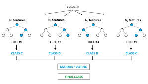

# Finding Commonalities in Misinformative Articles Across Topics
## What Data Are We Using?
         

Our data is collected from http://fakenews.research.sfu.ca/#parseWebs where we use the datasets containing Snopes, Politifact, and Emergent.info articles of varying real and fake news from 2010 to 2018. We took articles from each dataset to create a new dataset that contains real and fake news for specific genres of news. We gathered news about 100 data for each political and scientific topic from the Snopes, Politifact, and Emergent.info datasets to use as our training dataset. We also created a dataset filled with varying topics to use as our testing dataset The data included in this set is a mix of recent informative and misinformative articles. Our plan with these datasets is to find commonalities of misinformation across different topics. To do this, we are training our models based on set genres and then testing the results to a set of data with varying genres of news. 
## What are we trying to predict

 
For our research, we are using our training dataset to predict whether a random article, regardless of the genre, is misinformative or not. After Preprocessing with TFIDF We will train our models so that it learns the commonalities of misinformation for a set topic. Then we will test our findings onto a random article to see if our model can accurately predict whether that article is misinformative or not. We use the scores of the Decision Tree, Logistic Regression, Random Forest Classifier, and SVM to test our models’ accuracies. After our models make a prediction on a random genre article, we want to examine differences of misinformation across different genres of news.
## What models are we using for prediction
### Decision Tree

#### Decision Tree is a machine learning method that involves many leafs and branches to reach a classification.

### Logistic Regression

#### Logisitic Regression is a machine learning method that results in a discrete (1,0) classification based on variables inputted.

### Random Forest Classifier

#### Random Forest Classifier is a machine learning method that runs multiple decisions trees and uses the classification the majority choses.

### Support Vector Machine (SVM)

#### Support Vector Machine is a machine learning method used to find the best hyperplane that separates the data into two distinct classes.

### Data Analysis
#### Since our goal was to see if there were themes to the misinformation of each topic. We looked at what words would be the most important in deciding between misinformation. For consistency, we used logisitic regression as our base model for determining these clouds.

 

The image above is the word cloud of most important words for science articles. The most important words of science's word cloud are Lexus, chip, honey, and Ukraine.

The image above is the word cloud of most important words for economic articles. The most important words of economy's word cloud are been, for, and without.

The image above is the word cloud of most important words for political articles. The most important words of politics's word cloud are Florida, the, Maher, Romney, and King.

The image above is the word cloud of most important words for articles with the topics science, economy, and politics. The most important words for this word cloud are Covid, the, Romney, billion, playing, and for.

## Results and Conclusions
### Accuracy Percision and Recall
##### As is consistent with the other projects that look at this issue, we ended up with somewhat lower accuracies. The results below are our top performers for each topic.
#### General 
 
 
#### Science
 
 
#### Economics
 
 
#### Politics
 

##### We certainly had variances in success, but our best performing model was the science decision tree, with an accuracy of about 87%.
### Commonalities
#### The next part of our project was finding if these models overlapped in some way, so we looked at how much their list of important words intersected with each other.
#### For example, we found that the highest intersection was the intersection between General and Politics decision trees, with a similarity of 53.6%.
#### An example of a limited intersection was the Science SVM model with the Politics Decision-Tree model with a similarity of 2.4%.
#### While there are some limitation to this method, such as magnitude, we feel it shows important ways that these articles overlap in subject matter and in informativeness.

## Works Cited
